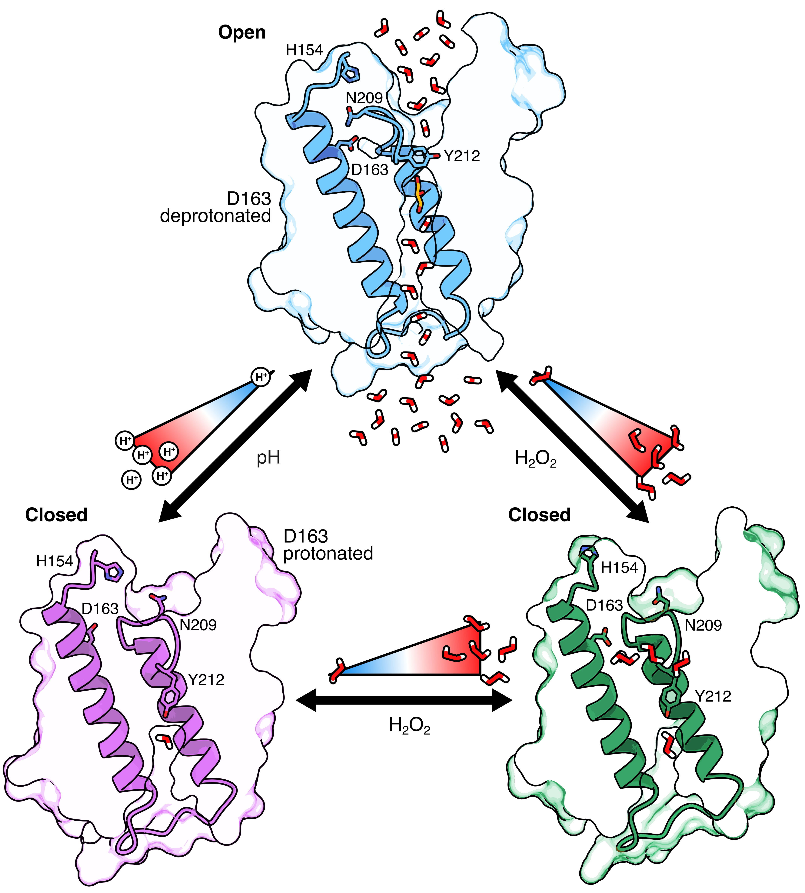

[]()
# Structural insights into AQP3 channel closure upon pH and redox changes reveal an autoregulatory molecular mechanism

Some structure files and simulation run files related to the paper:

> **Huang, P., Venskutonytė, R., Wilson, C.J., Bsharat, S., Prasad, R.B., Gourdon, P., Artner, I., de Groot, B.L., & Lindkvist-Petersson, K. (2025).**  
> *Structural insights into AQP3 channel closure upon pH and redox changes reveal an autoregulatory molecular mechanism*  
> Lund University & Copenhagen University & Max Planck Institute for Multidisciplinary Sciences.

---

<p>
  
  (Right) The proposed model of AQP3 gating: an equilibrium between the open state (blue), closed state (magenta), and a closed state with bound H2O2 (green) is governed by the changes in pH and the presence of H2O2.
</p>


---

## Cryo-EM structures

- pH 8.0 (open): `9QSX.pdb`
- pH 5.5 (closed): `9QSY.pdb`
- pH 8.0 + H2O2 (closed): `9QSZ.pdb`

## MD run files
- cphmd: contains initial structures for open/closed, and .mdp required for pH 7 simulation (just change pH value if you want high/low)
- unbiased: contains initial structures for open/closed, and .mdp. Protonation states were fixed to various protonation states, default GROMACS assignment structures are provided
- neq: pKa free energy calculations were initialzed from unbiased trajectories of the various endstates. `pmx` software was used for `.top` file generation. See Ref 1 for more discussion on these calculations.
[1] J. Chem. Theory Comput. 2023, 19, 21, 7833–7845 https://doi.org/10.1021/acs.jctc.3c00721

## Citation
If you are using this data please cite the paper:
```bibtex
@article{Huang2025,
  title = {Structural insights into AQP3 channel closure upon pH and redox changes reveal an autoregulatory molecular mechanism},
  volume = {16},
  url = {http://dx.doi.org/10.1038/s41467-025-67144-2},
  DOI = {10.1038/s41467-025-67144-2},
  number = {1},
  journal = {Nature Communications},
  publisher = {Springer Science and Business Media LLC},
  author = {Huang,  Peng and Venskutonytė,  Raminta and Wilson,  Carter J. and Bsharat,  Sara and Prasad,  Rashmi B. and Gourdon,  Pontus and Artner,  Isabella and de Groot,  Bert L. and Lindkvist-Petersson,  Karin},
  year = {2025},
  month = dec
}
```

## Get in touch
If you have any questions please email [me](cwilson@mpinat.mpg.de).
